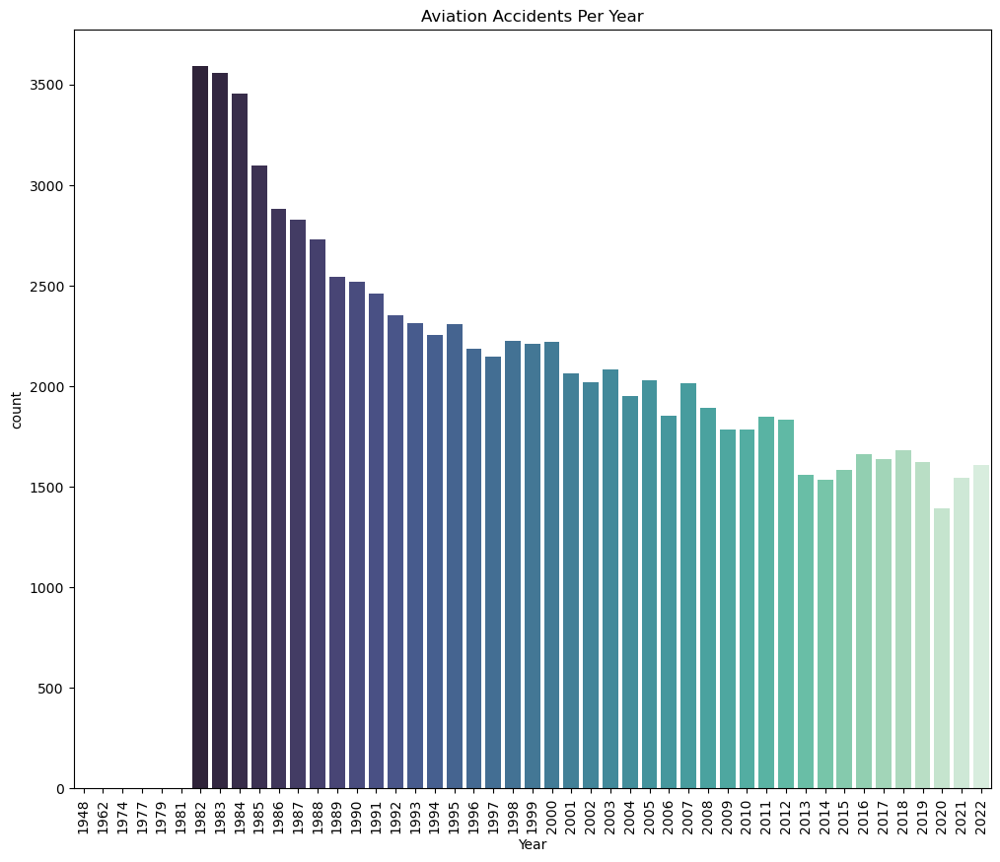
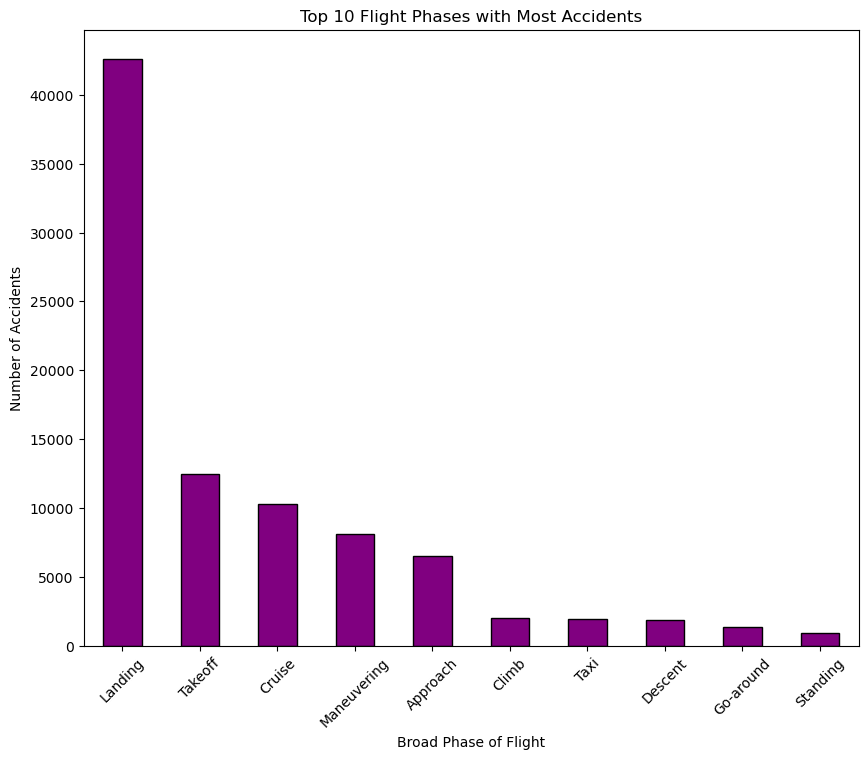
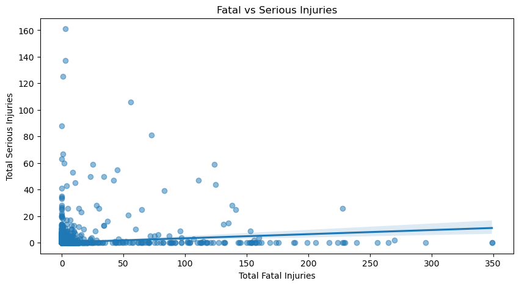

# Aviation Data Analysis Project
## Introduction
This project contains analysis and visualization of aviation accident data from the year . This data was obtained from the National Transportation Safety Board(NTSB).The analysis aims at identifying different factors that contribute to the occurrence of accidents and provide insights into how these factors can be addressed to reduce the number and severity of accidents.
## Business Understanding
### Stakeholders:
   * Airlines Operators- Reduce risks during operations and improve safety.
   * Aircraft Manufacturers- Improve safety features and designs to reduce accidents severity.
   * Training Organizations- Improve training programs of pilot and crew
   * Public/Passengers- Create awareness of the risks and safety measures thus boosting confidence in air travel safety.
### Business Question
   * What are the most common factors contributing to aviation accidents?
   * Are certain models of aircraft more prone to accidents?
   * What role does weather conditions play in aviation accidents?
   * What phases of flight are the most dangerous?
   * How have the accidents trends and patterns been with the advancements in technology over time?
   * Does human factors contribute to accidents?
   * What measures can be taken to reduce aviation accidents?

## Data Description
The data is organized in a csv file that contains different columns that contain information about the accidents. They include:
    * Weather conditions- Identify environment contributions to accidents.
    * Phase of flight-Give safety procedures for different phases of flight.
    * Total Injuries-For severity assessment
    * Aircraft Model-For profiling of fleet risk.
    * Engine Type-For mechanical reliability analysis.
    * Number of Engines- For redundancy analysis.
## Visualization
1.A Trend of Accidents over Years
*This visualization show the trend of of accidents over years.

2.Visualization of the Phase of flight with the highest number of accidents
*This visualization shows the most dangerous phase in aviation accidents.

3.Correlation between fatal accidents and serious injuries
It gives the correlation between fatal and serious accidents

## Tableau Interactive Dashboard Link
https://public.tableau.com/app/profile/barnice.nyawira/viz/Dashboard_17458676008920/AviationAccidentsanalysisinteractivedashbord?publish=yes
## Conclusion
### Findings
 1.Human error- Human error remains the most common cause of aviation accidents.

 2.Mechanical failure-This can be be caused by poor maintenance, faulty equipment among other reasons.
 
 3.Weather conditions- VMC and IMC is the leading cause of weather related accidents the aviation accidents.
 ### Recommendations
 1. Improving safety through advanced technology rigorous training
2. Strict regulations.
3. Enhanced pilot training
4. Better air traffic control systems have significantly reduced accidents
5. Enhance air traffic control systems.
